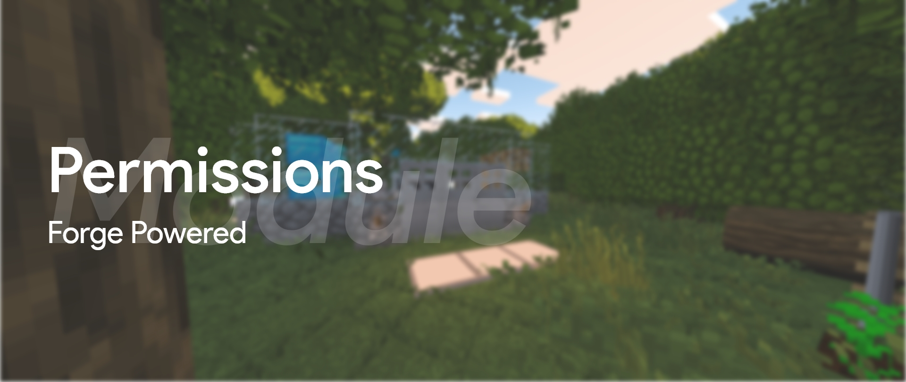
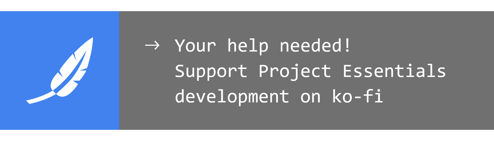

## Project Essentials Permissions: command permission provider for Project Essentials.

### What is this for?

This modification serves as a command permissions provider for players. It is very suitable for delimiting the permissions of players and limiting the player's capabilities, for example, to prohibit changing the weather or to allow repair items. If you ever used PermissionsEx for spigot, then you will not have problems with setting permissions. Also, the mod has its own API, to use it, start by [reading the documentation](documentation/for-developers.md).

### Explore

#### [Download mod](https://github.com/ProjectEssentials/ProjectEssentials-Permissions/releases/download/v1.14.4-1.1.0.0/Project.Essentials.Permissions-1.14.4-1.1.0.0.jar) · [How to install](documentation/for-players.md) · [Troubleshooting](https://github.com/ProjectEssentials/ProjectEssentials-Permissions/issues/new/choose) · [News & updates](https://t.me/minecraftforge) · [Change log](changelog.md)

### Compatibility

Currently mod branch supported forge version `28.0.X` and `28.1.X` (Minecraft `1.14.4`).

### Credits

- Author: Pavel Erokhin [@mairwunnx](https://github.com/mairwunnx)
- [JetBrains](https://www.jetbrains.com/) for Licenses
- Inspired by: [PermissionsEx](https://github.com/PEXPlugins/PermissionsEx)
